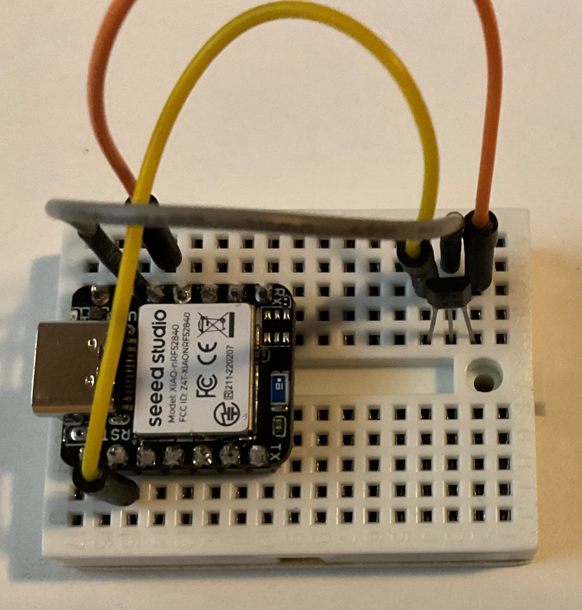

# BLE Beacon

We gaan een BLE Beacon maken dat de temperatuur adverteert. Hiervoor gebruiken de we [XIAO BLE](https://wiki.seeedstudio.com/XIAO_BLE/) module zodat de Nordic module als sniffer kan blijven dienen. (De XIAO BLE kan ook als sniffer geprogrameerd worden, helaas overschrijft dat de bootloader en is het daarna niet mogelijk nieuwe software op de module te zetten zonder JLink programmer.)

## XIAO BLE module voorbereiden

Deze module van Seeed is er in twee versies. We gebruiken in de workshop de simpele versie zonder de extra sensoren.

Voor we met de module aan de slag kunnen moeten eerst twee headers onderop gesoldeerd worden zodat we de module op een breadboard kunnen gaan gebruiken. Breek twee stukken van de correcte lengte van je pinheader strip en soldeer die onder de module.

Prik de module nu op je breadboardje met de USB connector aan de rand zodat je zonder moeite de USB kabel kunt aansluiten.

## De software

Zoals al vermeld gaan we een BLE Beacon maken. De software gaan we bouwen gebaseerd op Zephyr. Zephyr heeft overigens een hele stapel Bluetooth voorbeelden aan boord, werp vooral eens een blik in 'zephyrproject/zephyr/samples/bluetooh'. Let op, niet alle voorbeelden werken met alle hardware.

## Starten

Open een commando prompt op je laptop (Windows CMD, OSX Terminal). Activeer de virtuele environment die je bij de installatie van Zephyr aangemaakt hebt. Bij mij staat Zephyr op de D schijf in een folder bluetooth. Activeren wordt dan:

    d:\bluetooth\zephyrproject\.env\Scripts\activate.bat

(Onder OSX source je .env/Scripts/active)

Laad nu de variabelen die Zephyr nodig heeft met:

    d:\bluetooth\zephyrproject\zephyr\zephyr-env.cmd

(Onder OSX source zephyr/zephyr-env.sh)

Maak een nieuwe folder ergens op je schijf, bij voorkeur op een plaats waar geen spaties of punten in het pad voorkomen.

    mkdir d:\bluetooth\advertise-adc
    cd bluetooth\advertise.adc

Nu gaan we de structuur die Zephyr nodig heeft aanmaken. Begin met het maken van een boards en een src folder

    mkdir src boards

In de src folder komt de broncode van de applicatie in boards een 'overlay' waarin we specificeren hoe Zephyr bij de hardware kan komen.

Maar in de huidige folder moeten nog twee bestanden komen. De eerste is 'CMakeLists.txt' en die bevat:

    cmake_minimum_required(VERSION 3.20.0)
    find_package(Zephyr REQUIRED HINTS $ENV{ZEPHYRBASE})
    project(advertise-adc)

    target sources(app PRIVATE src/lmt86.c src/main.c)

Dit bestand bevat de informatie die het bouw systeem nodig heeft om te bepalen welke sources gebruikt moeten worden.

Het tweede bestand 'prj.conf' bevat:
    CONFIG_BT=y
    CONFIG_BT_DEBUG_LOG=y
    CONFIG_BT_DEVICE_NAME="ADC beacon"
    CONFIG_ADC=y
    CONFIG_ADC_ASYNC=y

Hiermee wordt Zephyr geconfigureerd, Bluetooth wordt aangezet, de naam van het Bluetooth device wordt gespecificeerd (je mag daar wat anders neerzetten) en de analoge ingang wordt aangezet. Dit laatste omdat de temperatuur sensor analoog is.

In de folder 'boards' staat een overlay bestand met de naam 'xiao_ble.overlay'. (De naam begint met het board dat we gebruiken en eindigs op overlay om aan te geven wat Zephyr er mee moet doen). De inhoud:

    /*
    * SPDX-License-Identifier: Apache-2.0
    *
    * Copyright (c) 2022 Nordic Semiconductor ASA
    */

    / {
        zephyr,user {
            io-channels = <&adc 0>;
        };
    };

    &adc {
        #address-cells = <1>;
        #size-cells = <0>;

        channel@0 {
            reg = <0>;
            zephyr,gain = "ADC_GAIN_1_6";
            zephyr,reference = "ADC_REF_INTERNAL";
            zephyr,acquisition-time = <ADC_ACQ_TIME_DEFAULT>;
            zephyr,input-positive = <NRF_SAADC_AIN1>; /* P0.03 */
            zephyr,resolution = <12>;
        };
    };

In dit bestand worden de parameters van de ADC gezet. We gaan pin P0.03 gebruiken als input.

En dan komen we bij de echte code. In de folder 'src' staan drie bestanden. Een include bestand wat definities bevat met de naam 'lmt86.h' en de inhoud:

    /*
    *
    * LMT86 interface
    *
    * Copyright (c) 2023 IoT-Noord
    *
    * SPDX-License-Identifier: MIT
    *
    */

    #ifndef __LMT86__H
    #define __LMT86__H

    const struct adc_dt_spec *get_device_lmt86();
    int16_t lmt86_get_temperature(const struct adc_dt_spec *d);
    #endif

De bijbehorende ADC code staat in lmt86.c:

    /*
    *
    * LMT86 
    *
    * Copyright (c) 2023 IoT-Noord
    *
    * SPDX-License-Identifier: MIT
    *
    */

    #include <inttypes.h>
    #include <stddef.h>
    #include <stdint.h>

    #include <zephyr/device.h>
    #include <zephyr/devicetree.h>
    #include <zephyr/drivers/adc.h>
    #include <zephyr/kernel.h>
    #include <zephyr/sys/printk.h>
    #include <zephyr/sys/util.h>

    #include "lmt86.h"

    const struct adc_dt_spec *get_device_lmt86()
    {
        int err;
        const static struct adc_dt_spec d = ADC_DT_SPEC_GET_BY_IDX(DT_PATH(zephyr_user), 0);

        if (!device_is_ready(d.dev)) {
                            printk("ADC controller device not ready\n");
                            return NULL;
        }

        err = adc_channel_setup_dt(&d);
        if (err < 0) {
            printk("Could not setup adc channel (%d)\n", err);
            return NULL;
        }

        return &d;
    }

    int16_t lmt86_get_temperature(const struct adc_dt_spec *d)
    {
        int err;
        int16_t buf;
        int32_t val_mv;
        float t;
        struct adc_sequence sequence = {
                    .buffer = &buf,
                    /* buffer size in bytes, not number of samples */
                    .buffer_size = sizeof(buf),
            };

            printk("ADC reading:\n");
            (void)adc_sequence_init_dt(d, &sequence);

            err = adc_read(d->dev, &sequence);
            if (err < 0) {
                printk("Could not read (%d)\n", err);
            } else {
                printk("%"PRId16, buf);
            }

        /* conversion to mV may not be supported, skip if not */
        val_mv = buf;
        err = adc_raw_to_millivolts_dt(d,
                        &val_mv);
        if (err < 0) {
            printk(" (value in mV not available)\n");
        } else {
            printk(" = %"PRId32" mV\n", val_mv);
        }

        /* translation from mV to temperature */
        t = DOE HIER IETS MET MILLIVOLT NAAR EEN TEMPERATUUR
        t = t * 10;

        return (int) t;
    }

In de functie get_device_lmt86 wordt het de analoge poort opgezocht en geconfigureerd. Er wordt niet echt gecontroleerd of er een sensor aan hangt. In de functie lmt86_get_temperature wordt een enkele analoge waarde opgehaald, omgezet naar millivolt en daarna wordt de temperatuur berekend.

Oplettende lezers zullen gezien hebben dat die omrekening niet compleet is. Daar moet nog een formule ingevuld worden, iets als:

    t = 5.0 + (( val_mv - BASIS ) / - DEELFACTOR );

Om de BASIS en de DEELFACTOR te bepalen zul je formule 3 op pagina 10 in de [LMT86 datasheet](https://www.ti.com/lit/ds/symlink/lmt86.pdf) moeten omzetten met je gewenste temperatuur bereik. Kies dat bereik niet te groot anders wordt het resultaat erg onnauwkeurig.

Terwijl je de datasheet open hebt, kijk meteen even naar de aansluitingen van de sensor (het LPG Package type), die heb je zo nodig bij het bedraden.

En zijn we eindelijk bij de belangrijkste code, het bestand 'main.c':

    /*
    * Advertise LMT86 temperature data 
    *
    * Copyright (c) 2023 IoT-Noord
    * Based on an example by Koen Vervloesem 
    *
    * SPDX-License-Identifier: MIT
    */

    #include <stddef.h>
    #include <stdio.h>
    #include <zephyr/bluetooth/bluetooth.h>
    #include <zephyr/bluetooth/hci.h>
    #include <zephyr/drivers/adc.h>
    #include <zephyr/sys/printk.h>
    #include <zephyr/sys/util.h>
    #include <zephyr/types.h>

    #include "lmt86.h"

    // Definitie van de 'advertentie' parameters
    #define ADV_PARAM                                                    \
    BT_LE_ADV_PARAM(0, BT_GAP_ADV_SLOW_INT_MIN,                        \
                    BT_GAP_ADV_SLOW_INT_MAX, NULL)

    // De data die geadverteerd wordt
    static struct bt_data advertisement[] = 
    {
        BT_DATA_BYTES(BT_DATA_FLAGS, BT_LE_AD_NO_BREDR),
        BT_DATA_BYTES(
            BT_DATA_MANUFACTURER_DATA, 0xff, 0xff, /* Test company ID */
            0x00, 0x00, 0x00 /* Temperature, packed bcd encoded (because we can) */
        )
    };

    // Update de advertentie data met een nieuwe meetwaarde
    void update_data(const struct adc_dt_spec *d) 
    {
        int16_t temp;
        char s[4];

        temp = lmt86_get_temperature(d);
        if (temp < 0)
        {
            s[0] = '-';
            temp = 0 - temp;
        }
        else
        {
            s[0]= 0;
        }

        // Limit range to 4 digit
        temp = temp % 10000;

        s[1]= ( temp / 1000 ) << 4; 
        temp = temp % 1000;
        s[1]= s[1] | ( temp / 100 );
        temp = temp % 100;
        s[2]= ( temp / 10 ) << 4; 
        temp = temp % 10;
        s[2]= s[2] | ( temp );
        s[3]= '\0';
        memcpy(&(advertisement[1].data[2]), &s, 3);
    }

    void main(void) 
    {
        int err;

        printk("Startup\n");

        // Get ADC device
        const struct adc_dt_spec *lmt86 = get_device_lmt86();

        if (lmt86 == NULL) 
        {
            printk("Failed to get ADC device\n");
            return;
        }

        // Initialize the Bluetooth subsystem
        err = bt_enable(NULL);
        if (err) 
        {
            printk("Bluetooth initialize failed (%d)\n", err);
            return;
        }

        printk("Bluetooth init done\n");

        // Start advertising sensor values
        update_data(lmt86);
        err = bt_le_adv_start(ADV_PARAM, advertisement, ARRAY_SIZE(advertisement), NULL, 0);

        if (err) 
        {
            printk("Advertising start failed (%d)\n", err);
            return;
        }

        while (1) 
        {
            k_sleep(K_MSEC(970));
            update_data(lmt86);
            err = bt_le_adv_update_data(advertisement, ARRAY_SIZE(advertisement), NULL, 0);

            if (err) 
            {
            printk("Advertising data update failed (%d)\n", err);
            return;
            }
        }
    }

Als alle bestanden met de correcte inhoud op de plaats staan gaan we vertalen:

    west build -p always -b xiao_ble .

Dit levert een warning over 'pointer types' voor memcpy op. Die kun je negeren. Als het goed gaat eindigd de uitvoer ongeveer als volgt:

    [232/232] Linking C executable zephyr\zephyr.elf
    Memory region         Used Size  Region Size  %age Used
            FLASH:       94224 B       788 KB     11.68%
                RAM:       24424 B       256 KB      9.32%
            IDT_LIST:          0 GB         2 KB      0.00%
    Converting to uf2, output size: 188928, start address: 0x27000
    Wrote 188928 bytes to zephyr.uf2

Het resultaat is een UF2 bestand dat we kunnen gebruiken om de XIAO BLE te programmeren. Sluit daarvoor de module op de laptop aan met je USB kabel. Nu moet er een extra drive beschikbaar komen met de naam 'XIAO-SENSE'. Als dat niet gebeurd moet je twee maal snel achter elkaar op de resetknop drukken. Nou ja, knop... Het is het minime zwarte puntje in het metalen plaatje naast de USB connector.

Om de XIAO BLE te programmeren met de nieuwe code kopieer je het bestand build\zephyr\zephyr.uf2 naar de hoofd folder van de XIAO-SENSE drive.

    copy build\zephyr\zephyr.uf2 e:

Na het kopieren zal de module zich resetten en de drive automatisch weer verdwijnen.

## Sensor aansluiten

Koppel de USB aansluiting los en prik de temperatuur sensor ook je breadboard. Sluit de poten aan op de XIAO BLE pinnen GND, 3V3 en P0.03. (Zie de datasheet voor de pennen van de sensor en de WIKI pagina van de XAIO BLE voor de pennen van de module)

Als je er van overtuigd bent dat alles goed aangesloten is (denk eraan dat ik **geen** reserve onderdelen heb, het was al moeilijk genoeg hier aan te komen) kun je de USB weer aansluiten. De module is nu zichtbaar als COM poort en communiceert op 115200.

Pak je mobiel en kijk of je je beacon terug kunt vinden...

En als er iemand denkt dat in bovenstaande plaatje de temperatuur vreemd is, dat klopt. Ik had de sensor niet aangesloten.

**HINT** Als je je eigen module makkelijk terug wilt kunnen vinden kun je natuurlijk voor de temperatuur een extra byte met een unieke code toevoegen.

In Wireshark kun je een filter zetten op de 'Unassigned manufacturer':

    btcommon.eir_ad.entry.company_id == 0xffff
