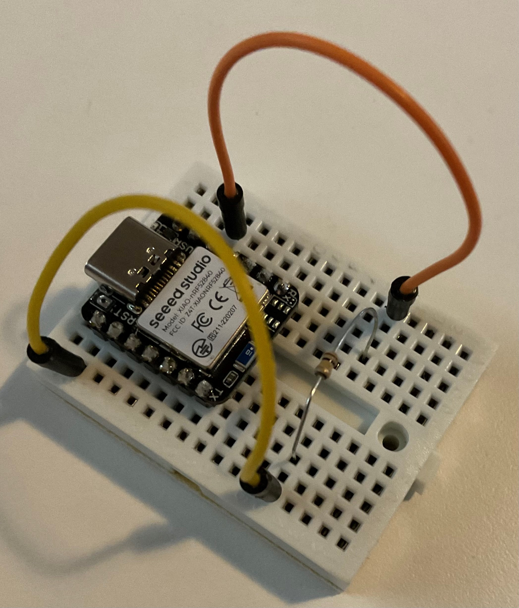
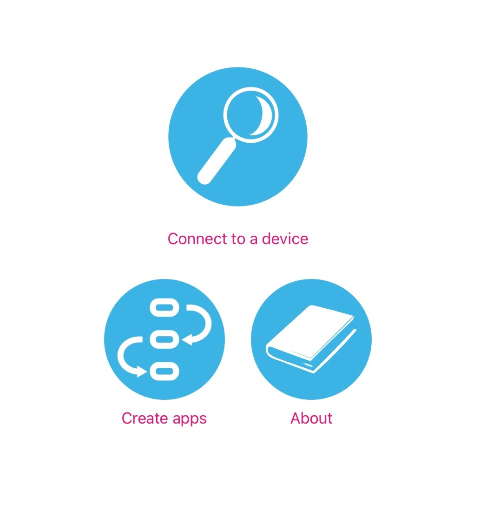
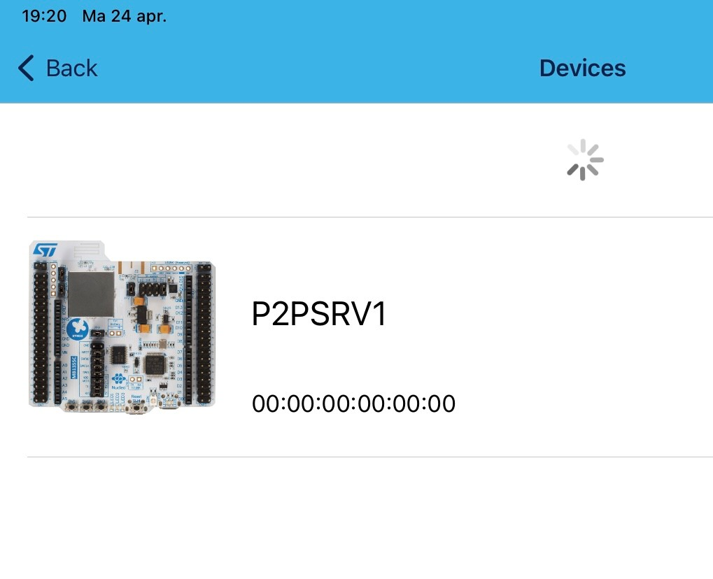
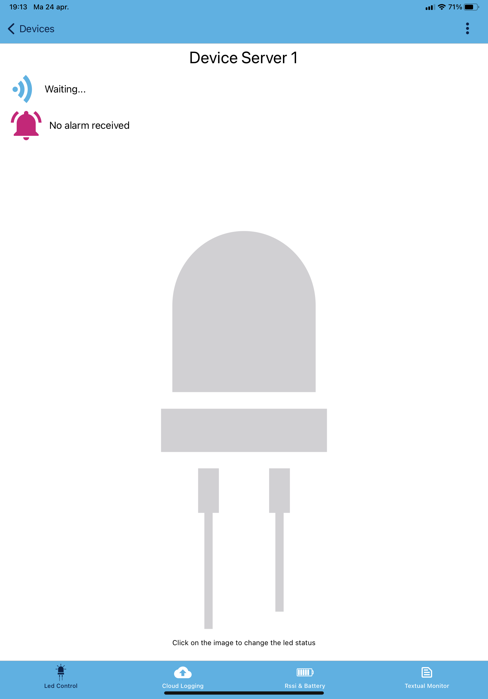

# ST BLE

We gaan een LED op de XIAO module schakelen met onze mobiele telefoon.

## ST BLE Sensor APP

Als je de App nog niet gedownload hebt, ga naar de [ST site](https://www.st.com/en/embedded-software/stblesensor.html) en kies 'Get SOftware'. Selecteer bij 'Part Number' 'STBLESensor-Android' of 'STBLESensor-iOS' de knop 'Go to site'.

OF ga naar Google Play of de App Store en zoek op 'ST BLE'.

## Zephyr code

Het grootste deel van de code wordt bij de voorbeelden van Zephyr meegeleverd. Deze is alleen nog niet geschikt voor onze hardware, dus daar hebben we een (minimale) aanvulling voor nodig.

Kopieer eerst de folder met de voorbeeld code, in mijn geval D:\bluetooth\zephyrproject\zephyr\samples\bluetooth\st_ble_sensor in zijn geheel naast de eerder gemaakte folder (D:\bluetooth\advertise-adc) zodat je D:\bluetooth\st_ble_sensor (voor mij) krijgt.

Maak in die folder nu een extra folder aan met de naam boards en zet daarin het bestand xiao_ble.overlay met als inhoud:

    /* SPDX-License-Identifier: Apache-2.0
    *
    * Copyright (c) 2022 Nordic Semiconductor ASA
    */

    / {
            gpio_keys {
                    compatible = "gpio-keys";
                    user_button: button {
                            label = "User";
                            gpios = <&gpio0 2 GPIO_ACTIVE_LOW>;
                    };
            };

            aliases {
                    sw0 = &user_button;
            };
    };

Met de definitie in dit bestand maken we pin P0.02 een input waar we een drukknop aan zouden kunnen hangen.

**LET OP** We gaan nu de temperatuur sensor verwijderen en daarvoor in de plaats de 100K weerstand plaatsen als Pull-Up weerstand. Prik de weerstand op het breadboard, verwijder de bedrading van de temperatuur sensor en sluit een draad aan op P0.02 en een kant van de weerstand. Bedraad de andere kant van de weerstand naar de 3V3 aansluiting. 

Open een commando prompt of terminal en zorg dat je de virtuele environment actief hebt en dat de Zephyr paden bekend zijn (kijk in de [ble-beacon instructies](ble-beacon.md) als je een reminder nodig hebt).

Vertaal nu de code.

    west build -p auto -b xiao_ble .

Kopieer nu het gegenereerde bestand naar de module om deze te flashen

    copy build\zephyr\zephyr.uf2 e:

Als de module herstart is open je de ST BLE Sensor App op je telefoon. 

Kies in het hoofdscherm 'Connect to a device' en wacht tot je module gevonden is bij het scannen.

Oeps. Jouw module? Als iedereen om je heen ook lekker bezig is kun je er zomaar een aantal zien verschijnen. En hoe weet je welke van jou is? Laten we daar eens wat aan doen.

Open het bestand prj.conf en pas de naam 'P2PSRV1' aan naar iets unieks, beperk het tot 7 leters/cijfers.

Bouw de applicatie opniew, reset de module en flash.

Laat de App nu opnieuw scannen. Als het goed is kun je nu herkennen welke module je moet hebben.

Als je nu de module selecteert krijg je een scherm met led. Tik die aan en kijk wat er met de led op de XIAO-BLE module gebeurt.

Kies 'Devices' links boven terwijl de led brand. Laat de App opnieuw scannen en open je module opnieuw. Wat is nu de status van de led in de App? En wat op de module?

Je ziet dat de App niet de werkelijke status opvraagt bij het maken van de verbinding. Dat zou een mogelijke verbetering zijn. En het is je vast opgevallen dat je zomaar verbinding kunt maken zonder een PIN of iets dergelijks in te voeren. Dat komt omdat de applicatie willekeurige verbindingen accepteerd. Ook dat zou verbeterd kunnen worden. (Zie [bonus](bonus.md) voor een oplossing.)

Reset nu het bord (enkele reset), zodat de led uit gaat maar de BLE applicatie blijft draaien.

Nu een leuke uitdaging, probeer met Wireshark de advertisements van je device te vinden. Zet dan een filter zodat je alleen data van dat MAC adres ziet (de dropdown achter 'Device' helpt vast). Open dan de App op je telefoon, zoek je device, verbind er mee en zet de led aan.

Probeer met de gegevens die je nu hebt uit te vinden hoe je met de nRF Connect applicatie of telefoon App de led aan en uit kunt zetten.

